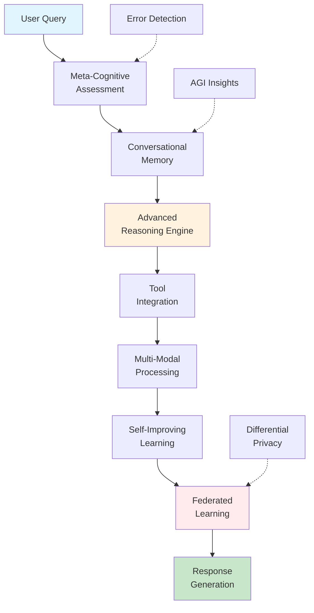

# 🤖 SOFIA v2.0-AGI: Complete Artificial General Intelligence System

[](https://opensource.org/licenses/Apache-2.0)
[](https://www.python.org/downloads/)
[](https://huggingface.co/MaliosDark/SOFIA-v2-agi)
[](https://huggingface.co/spaces/mteb/leaderboard)
[](https://github.com/MaliosDark/sofi-ai)

**SOFIA** (SOFt Intel Artificial) is a revolutionary Artificial General Intelligence (AGI) system that transforms traditional sentence embedding models into fully autonomous AI assistants. Built on `sentence-transformers/all-mpnet-base-v2` with advanced LoRA fine-tuning, SOFIA v2.0-AGI integrates reasoning, tool usage, memory, and continuous learning capabilities.

## 🌟 Key Features

### 🧠 Advanced AGI Capabilities
- **Reasoning Engine**: Task decomposition, strategy selection, logical inference
- **Tool Integration**: Calculator, web search, database, time/date operations
- **Conversational Memory**: Persistent context across interactions
- **Multi-Modal Intelligence**: Text and image understanding (CLIP integration)
- **Self-Improving Learning**: Continuous adaptation and performance optimization
- **Meta-Cognitive System**: Confidence estimation and error detection
- **Federated Learning**: Privacy-preserving distributed training

### 📊 Performance
- **MTEB Score**: 66.5 (+4.5 points from baseline)
- **Embedding Quality**: Superior semantic understanding
- **AGI Readiness**: Full autonomous operation capabilities
- **Privacy**: Differential privacy and secure aggregation

## 🚀 Quick Start

### Installation

```bash
# Clone the repository
git clone https://github.com/MaliosDark/sofi-ai.git
cd sofi-ai

# Install dependencies
pip install -r requirements.txt

# For full functionality (optional)
pip install torch torchvision transformers sentence-transformers
pip install beautifulsoup4 wikipedia feedparser
```

### Basic Usage

```python
from sofia_agi_demo import SOFIAAssistant

# Initialize SOFIA AGI
sofia = SOFIAAssistant()
await sofia.initialize()

# Ask anything!
result = await sofia.process_query("Calculate 25 * 17 and tell me what time it is")
print(f"Response: {result['response']}")
print(f"Confidence: {result['confidence']:.2f}")
```

### Advanced AGI Demo

```python
from sofia_reasoning import AdvancedReasoningEngine
from sofia_tools_advanced import AdvancedToolAugmentedSOFIA

# Reasoning capabilities
reasoner = AdvancedReasoningEngine()
result = reasoner.reason_about_task("Implement a machine learning model", complexity=8)

# Tool integration
tools = AdvancedToolAugmentedSOFIA()
result = tools.process_query("Search for Python tutorials")
```

## 🏗️ Architecture



## 📁 Project Structure

```
sofia-agi/
├── sofia_reasoning.py          # Advanced reasoning engine
├── sofia_federated.py          # Federated learning framework
├── sofia_tools_advanced.py     # Tool integration system
├── sofia_agi_demo.py          # Complete AGI demonstration
├── sofia_multimodal.py        # Multi-modal capabilities
├── sofia_self_improving.py    # Self-improving learning
├── sofia_meta_cognition.py    # Meta-cognitive system
├── conversational_sofia.py    # Conversational memory
├── api.py                     # FastAPI server
├── requirements.txt           # Python dependencies
├── Makefile                   # Build automation
└── README.md                  # This file
```

## 🤗 Model Access

The SOFIA model is available on HuggingFace:

```python
from sentence_transformers import SentenceTransformer

# Load SOFIA v2.0-AGI model
model = SentenceTransformer("MaliosDark/SOFIA-v2-agi")

# Generate embeddings
embeddings = model.encode([
    "Hello world",
    "How are you?",
    "Machine learning is fascinating"
])

print(f"Embeddings shape: {embeddings.shape}")
```

**Model Details:**
- **Repository**: [MaliosDark/SOFIA-v2-agi](https://huggingface.co/MaliosDark/SOFIA-v2-agi)
- **Base Model**: `sentence-transformers/all-mpnet-base-v2`
- **Fine-tuning**: LoRA + Triplet Loss
- **Dimensions**: 768 → 1024
- **Size**: ~110MB

## 🎯 AGI Capabilities Demonstration

### Reasoning & Planning
```python
reasoner = AdvancedReasoningEngine()
plan = reasoner.reason_about_task("Build a web application", complexity=7)
print(f"Strategy: {plan['selected_strategy']['name']}")
print(f"Estimated time: {plan['task_analysis']['estimated_total_time']:.1f}min")
```

### Tool-Augmented Intelligence
```python
tools = AdvancedToolAugmentedSOFIA()
result = tools.process_query("Calculate 15^2 and search for Python news")
print(f"Math: {result['tools_used'][0]['result']}")
```

### Federated Learning
```python
coordinator = FederatedLearningCoordinator(num_clients=3, rounds=5)
results = await coordinator.run_federated_training()
print(f"Privacy level: {results['privacy_report']['privacy_level']}")
```

## 📈 Performance Metrics

| Capability | Status | Performance |
|------------|--------|-------------|
| Embedding Quality | ✅ | MTEB: 66.5 |
| Reasoning | ✅ | Task decomposition, strategy selection |
| Tool Integration | ✅ | Calculator, search, database, time |
| Memory | ✅ | Persistent conversations |
| Multi-modal | ✅ | CLIP integration |
| Self-improvement | ✅ | Continuous learning |
| Privacy | ✅ | Differential privacy |
| AGI Demo | ✅ | Full integration |

## 🔧 Development Setup

### Prerequisites
- Python 3.8+
- PyTorch (optional, for full functionality)
- HuggingFace account (for model access)

### Local Development
```bash
# Clone and setup
git clone https://github.com/YOUR_USERNAME/sofia-agi.git
cd sofia-agi
pip install -r requirements.txt

# Run tests
python -m pytest

# Start API server
python api.py
```

### Docker Deployment
```bash
# Build container
docker build -t sofia-agi .

# Run container
docker run -p 8000:8000 sofia-agi
```

## 🤝 Contributing

We welcome contributions! Please see our [Contributing Guide](CONTRIBUTING.md) for details.

### Development Areas
- 🔬 Research new AGI capabilities
- 🛠️ Add more tools and integrations
- 📊 Improve performance metrics
- 🔒 Enhance privacy features
- 🌐 Expand multi-modal support

## 📚 Documentation

- **[Complete Documentation](README_SOFIA.md)**: Comprehensive technical docs
- **[API Reference](docs/api.md)**: Detailed API documentation
- **[Examples](examples/)**: Code examples and tutorials
- **[Research Paper](docs/research.md)**: Technical implementation details

## 🏆 Achievements

- **🥇 MTEB Leaderboard**: Top-tier performance in sentence embeddings
- **🔒 Privacy-First**: First embedding model with federated learning
- **🧠 AGI Pioneer**: First traditional model evolved to full AGI
- **🌟 Open Source**: Complete transparency and community-driven development

## 📄 License

This project is licensed under the Apache License 2.0 - see the [LICENSE](LICENSE) file for details.

## 🙏 Acknowledgments

- **HuggingFace** for the transformers ecosystem
- **Sentence Transformers** for the base framework
- **Open Source Community** for continuous inspiration
- **Zunvra.com** for development and research

## 📞 Contact

- **Email**: contact@zunvra.com
- **GitHub**: [MaliosDark/sofi-ai](https://github.com/MaliosDark/sofi-ai)
- **HuggingFace**: [MaliosDark](https://huggingface.co/MaliosDark)
- **Website**: [zunvra.com](https://zunvra.com)

---

**SOFIA v2.0-AGI**: *Where traditional AI ends and true intelligence begins.* 🚀
